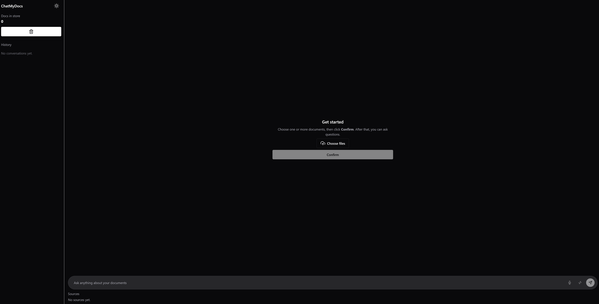
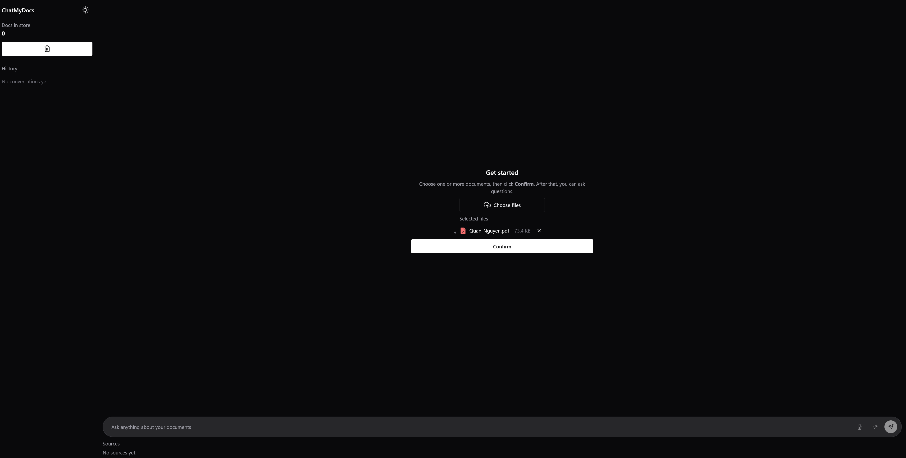
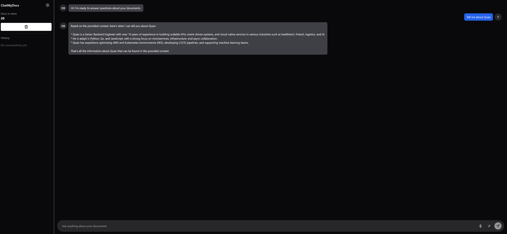

# ChatMyDocs 🗂️🤖 — Local RAG Chatbot

[](LICENSE)


[](https://github.com/your-username/ChatMyDocs/actions)

**ChatMyDocs** lets you upload PDFs/DOCX/TXT and chat with them locally.
No cloud LLM required — it runs against **Ollama** (local LLM + embeddings), **LangChain**, **ChromaDB**, **FastAPI**, and a clean **React + Vite + Chakra UI** front‑end.

> 🧑‍💻 *Non-technical?* Think of it like “Ctrl+F on steroids” for your own documents — private and on your machine.

---

## ✨ Features

* Upload **PDF / DOCX / TXT** and ask questions about them
* Local inference with **Ollama** (e.g. `llama3`, `mxbai-embed-large`)
* **RAG** pipeline (retrieve relevant chunks → grounded answers)
* Sleek chat UI (typing indicator, right‑aligned user bubbles, empty state for file picker)
* One-click **Reset corpus** and re‑ingest
* Dev-friendly: **FastAPI**, **LangChain**, **Chroma**, **Chakra UI**
* CI: Ruff + Pytest + ESLint + Typecheck on GitHub Actions

---

## 🧭 Demo

*Add a GIF or screenshots here after you run it locally.*

<p align="center">
  
</p>

<p align="center">
  
</p>

<p align="center">
  
</p>

---

## 🧱 Architecture (high level)

```
React (Vite + Chakra)  ─┬── Chat UI / Upload / History
                        │
                        └── calls REST
FastAPI ────────────────────────────────────────────────────────────
  /ingest  -> save uploads → loaders → splitter → Chroma.add_documents (embeds via Ollama)
  /query   -> retriever (Chroma) → LLM (Ollama) via LangChain → answer + sources
  /stats   -> count vectors
  /reset   -> delete & recreate collection + refresh chain

Local services
  Ollama  : LLM (e.g. llama3) + Embeddings (mxbai-embed-large)
  Chroma  : on-disk vector store (./backend/chroma_store)
```

---

## 🚀 Quickstart (Windows)

### 0) Prereqs

* **Python 3.12**
* **Node 20+** (or latest LTS)
* **Ollama** installed & running: [https://ollama.com/](https://ollama.com/)
* Pull models (first time):

```bat
ollama pull llama3
ollama pull mxbai-embed-large
```

### 1) Clone

```bat
git clone https://github.com/thereds11/ChatMyDocs.git
cd ChatMyDocs
```

### 2) Backend (FastAPI)

```bat
cd backend
python -m venv .venv
.\.venv\Scripts\activate
pip install -r requirements.txt
```

**(optional) Configure** — create `backend\.env` to override defaults:

```
BASE_URL=http://localhost:11434
LLM_MODEL=llama3
EMBED_MODEL=mxbai-embed-large
PERSIST_DIR=chroma_store
COLLECTION_NAME=chatmydocs
CHUNK_SIZE=800
CHUNK_OVERLAP=100
TOP_K=4
ALLOWED_ORIGINS=["http://localhost:8001","http://127.0.0.1:8001"]
```

Run:

```bat
uvicorn app.main:app --reload --port 8000
```

Health check:

```bat
curl http://localhost:8000/health
```

### 3) Frontend (Vite + React)

```bat
cd ..\frontend
npm i
```

Create `frontend\.env.local`:

```
VITE_API_URL=http://localhost:8000
```

Run:

```bat
npm run dev
```

Open: `http://localhost:8001/` (or the port Vite prints)

### 4) Use it

1. On first load, you’ll see **Get started** (file picker centered).
2. Choose files → **Confirm** → wait for ingest (first run may take longer while models warm up).
3. You’ll get a bot message: **“I’m ready to answer…”**
4. Ask away. Sources appear under the transcript.

---

## 🧪 Developer Experience

### Lint / Format / Test (backend)

```bat
cd backend
.\.venv\Scripts\activate
.\run_lint.bat --fix
.\test.bat
```

### Lint / Typecheck / Build (frontend)

```bat
cd frontend
npm run lint
npm run typecheck
npm run build
```

CI runs both workflows on push/PR: see **Actions** tab.

---

## 🔌 API (for tinkerers)

| Method | Path      | Body                        | Returns                             |
| -----: | --------- | --------------------------- | ----------------------------------- |
|    GET | `/health` | –                           | `{ ok: true }`                      |
|    GET | `/stats`  | –                           | `{ documents: number }`             |
|   POST | `/ingest` | `multipart/form-data files` | `{ added_chunks, total_documents }` |
|   POST | `/query`  | `{ "question": "..." }`     | `{ answer: string, sources: [] }`   |
|   POST | `/reset`  | –                           | `{ ok: true, message: "..." }`      |

---

## 🛠️ Troubleshooting (Windows tips)

* **Ingest hangs on first run**
  The embedding model loads lazily. We bumped the frontend request timeout and added backend logs. Check terminal logs for `/ingest: adding N chunks…` — it will finish.
* **Reset then ingest hangs**
  We rebuild the Chroma instance & refresh the chain on `/reset`. If you killed the server mid‑ingest, stop/restart the backend.
* **“Model not found”**
  `ollama list` → if `llama3` or `mxbai-embed-large` missing, `ollama pull <name>`.
* **CORS**
  Change `ALLOWED_ORIGINS` in `backend/.env`. Restart backend.
* **Chroma lock on Windows**
  Avoid deleting `chroma_store` while server is running.

---

## 🧭 Roadmap

* [ ] Streaming responses (token‑by‑token)
* [ ] Source preview (page snippets)
* [ ] Conversation history (local)
* [ ] Multi‑doc collections / named workspaces
* [ ] Light Docker image (optional)
* [ ] Packaging (one‑click binaries)

---

## 🤝 Contributing

PRs welcome!

Please:

* use **Conventional Commits** (`feat: …`, `fix: …`, `chore: …`)
* run linters & tests before pushing:

```bat
cd backend && .\.venv\Scripts\activate && .\run_lint.bat --fix && .\test.bat
cd ..\frontend && npm run lint && npm run typecheck
```

---

## 📜 License

Released under the **MIT License**.

Copyright © 2025 **Your Name**

See [LICENSE](LICENSE) for the full text.
---

## 🙏 Acknowledgements

* [Ollama](https://ollama.com/) — local LLM runtime
* [LangChain](https://python.langchain.com/) — LLM app framework
* [Chroma](https://www.trychroma.com/) — vector store
* [FastAPI](https://fastapi.tiangolo.com/) — web API
* [Chakra UI](https://chakra-ui.com/) — React components
* [Vite](https://vitejs.dev/) — blazing fast dev server
